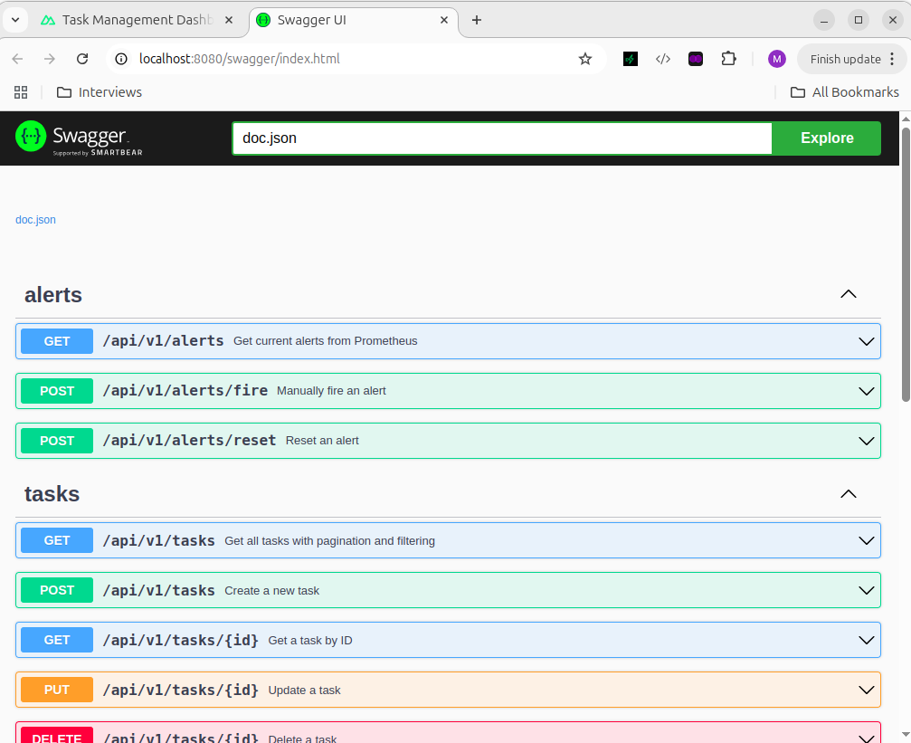
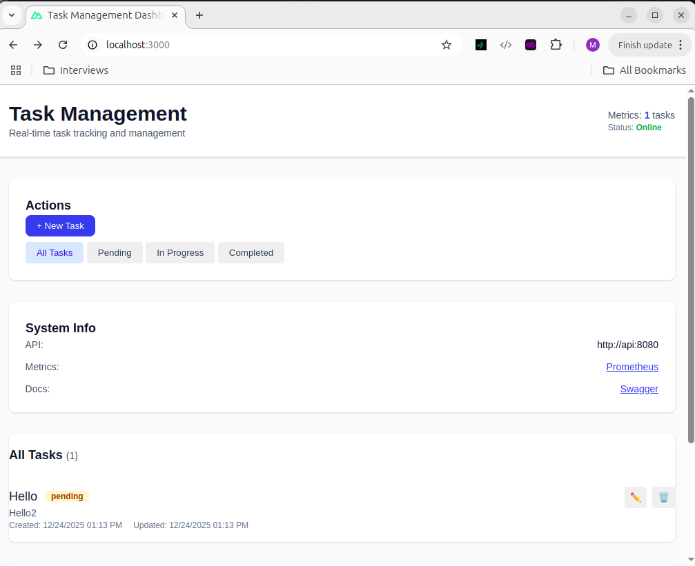
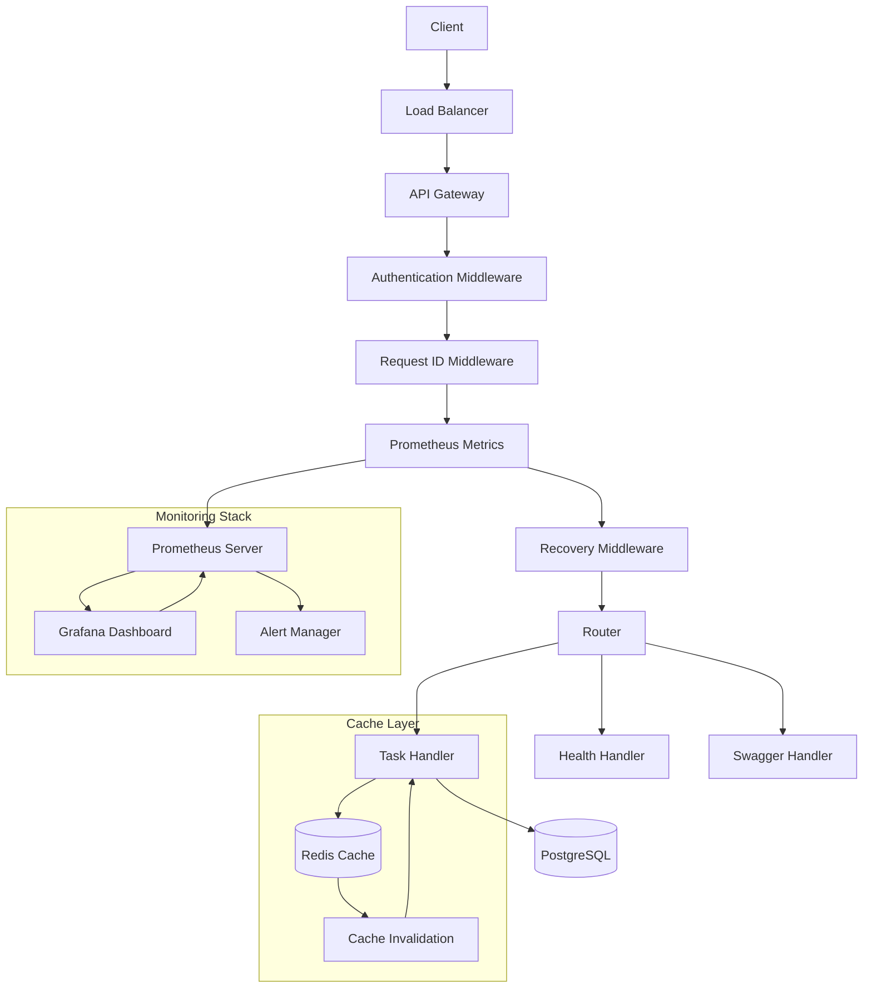

# Task Management API

A comprehensive RESTful API for managing tasks built with Go, Gin, and PostgreSQL using GORM. Features full CRUD operations, Redis caching, Prometheus monitoring, and complete API documentation.

## Features

- Full CRUD operations for tasks
- Task status management (pending, in_progress, completed)
- Pagination and filtering support
- UUID-based task identification
- PostgreSQL with GORM ORM
- Configurable Redis caching for improved performance
- Prometheus metrics and monitoring
- Request tracing with unique IDs
- Containerized with Docker Compose
- Health check endpoint
- Swagger API documentation

## Tech Stack

- **Backend**: Go 1.25.5
- **Framework**: Gin
- **Database**: PostgreSQL
- **ORM**: GORM
- **Cache**: Redis (configurable, with in-memory fallback)
- **Monitoring**: Prometheus
- **Documentation**: Swagger/OpenAPI
- **Testing**: Go testing framework
- **Containerization**: Docker & Docker Compose

## API Documentation Screenshot

This screenshot displays the interactive Swagger UI documentation interface for the Task Management API, showcasing all available endpoints and their specifications.



## Frontend Interface Screenshot

This screenshot shows the frontend interface of the Task Management application, providing a user-friendly web interface to interact with the API endpoints.




## Architecture



## Quick Start

### Prerequisites

- Docker and Docker Compose installed
- Go 1.25.5 or later (for local development)
- PostgreSQL and Redis (for local development)

### Running the Application

#### With Docker Compose (Recommended)

1. Clone the repository:
```bash
git clone <repository-url>
cd graph-interview
```

2. Start all services:
```bash
docker-compose up -d
```

3. The API will be available at `http://localhost:8080`

#### Local Development

1. Set up environment variables:
```bash
export DB_HOST=localhost
export DB_PORT=5432
export DB_USER=postgres
export DB_PASSWORD=password
export DB_NAME=taskdb

export REDIS_HOST=localhost
export REDIS_PORT=6379
export REDIS_PASSWORD=""
export REDIS_DB=0

export SERVER_PORT=8080
```

2. Install dependencies:
```bash
go mod download
```

3. Run the application:
```bash
go run cmd/api/main.go
```

### Environment Variables

| Variable | Default | Description |
|----------|---------|-------------|
| `DB_HOST` | localhost | PostgreSQL host |
| `DB_PORT` | 5432 | PostgreSQL port |
| `DB_USER` | postgres | PostgreSQL username |
| `DB_PASSWORD` | - | PostgreSQL password |
| `DB_NAME` | taskdb | Database name |
| `REDIS_HOST` | localhost | Redis host for caching |
| `REDIS_PORT` | 6379 | Redis port |
| `REDIS_PASSWORD` | - | Redis password |
| `REDIS_DB` | 0 | Redis database number |
| `CACHE_ENABLED` | true | Enable/disable Redis caching |
| `SERVER_PORT` | 8080 | API server port |

## API Endpoints

### Tasks
- `GET /tasks` - List all tasks with pagination and filtering
- `POST /tasks` - Create a new task
- `GET /tasks/{id}` - Get a specific task
- `PUT /tasks/{id}` - Update a task
- `DELETE /tasks/{id}` - Delete a task

### Monitoring
- `GET /metrics` - Prometheus metrics endpoint
- `GET /health` - Health check endpoint

### Documentation
- `GET /swagger` - Swagger UI documentation

## Monitoring & Metrics

The application exposes Prometheus metrics at `/metrics`:

### Available Metrics

- `requests_total` - Total HTTP requests with method, path, and status labels
- `request_latency_histogram_seconds` - Request latency histogram with method and path labels
- `tasks_count` - Current number of tasks in the database

### Prometheus Setup

When using Docker Compose, Prometheus is automatically deployed and configured:

**Access Prometheus UI:**
```
http://localhost:9090
```

**Query Examples:**
```promql
# Total requests
requests_total

# Request rate (requests per second)
rate(requests_total[1m])

# Average request latency
histogram_quantile(0.95, rate(request_latency_histogram_seconds_bucket[5m]))

# Current task count
tasks_count

# Requests by status code
requests_total{job="task-api"}
```

**Configuration:**
- Prometheus configuration: `prometheus.yml`
- Scrape interval: 10 seconds
- Data retention: Default (15 days)
- Metrics endpoint: `http://api:8080/metrics`

### Request Tracing

Every request includes a unique `X-Request-ID` header for tracing and debugging.

## Caching

The application uses Redis for high-performance caching. Set `CACHE_ENABLED=true` to enable Redis caching (default: enabled).

**Redis Configuration:**
- Host and port configurable via `REDIS_HOST` and `REDIS_PORT`
- Password protection via `REDIS_PASSWORD`
- Database selection via `REDIS_DB`

**Caching Behavior:**
- **GET /tasks/{id}** - Cached for improved read performance
- **Cache Invalidation** - Automatic invalidation on create/update/delete operations
- **Fallback** - Graceful fallback to database when cache is unavailable or disabled

## Testing

Run the test suite:

```bash
# Run all tests
./test.sh

# Run tests with coverage
go test ./... -cover

# Run tests with coverage report
go test ./... -coverprofile=coverage.out
go tool cover -html=coverage.out -o coverage.html
```

## Development

### Local Development Setup

1. Install dependencies:
```bash
go mod download
```

2. Set up PostgreSQL and Redis:
```bash
# Using Docker
docker run --name postgres-dev -e POSTGRES_PASSWORD=password -p 5432:5432 -d postgres:15
docker run --name redis-dev -p 6379:6379 -d redis:7
```

3. Run migrations:
```bash
go run cmd/migrate/main.go
```

4. Run the application:
```bash
go run cmd/api/main.go
```

### Code Quality

```bash
# Run linting
./lint.sh

# Run tests
./test.sh

# Format code
go fmt ./...
```

## Contributing

1. Fork the repository
2. Create a feature branch (`git checkout -b feature/amazing-feature`)
3. Make your changes
4. Add tests for new functionality
5. Ensure all tests pass (`./test.sh`)
6. Commit your changes (`git commit -m 'Add amazing feature'`)
7. Push to the branch (`git push origin feature/amazing-feature`)
8. Open a Pull Request

### Code Style

- Follow Go conventions and best practices
- Write comprehensive tests for new features
- Update documentation as needed
- Use meaningful commit messages

## Deployment

### Docker Deployment

```bash
# Build the image
docker build -t task-api .

# Run with Docker Compose
docker-compose up -d
```

### Environment Configuration

For production deployment, ensure the following environment variables are set:

```bash
# Database
DB_HOST=your-db-host
DB_PORT=5432
DB_USER=your-db-user
DB_PASSWORD=your-db-password
DB_NAME=taskdb

# Redis
REDIS_HOST=your-redis-host
REDIS_PORT=6379
REDIS_PASSWORD=your-redis-password
REDIS_DB=0

# Server
SERVER_PORT=8080
```

## License

This project is licensed under the Apache License 2.0 - see the LICENSE file for details.

```bash
# Set environment variables
export DB_HOST=localhost
export DB_USER=postgres
export DB_PASSWORD=your_password
export DB_NAME=taskdb
export SERVER_PORT=8080

# Run the application
go run cmd/api/main.go
```

The API will be available at `http://localhost:8080`

### Environment Variables

You can customize the following environment variables in your `docker-compose.yml` or `.env` file:

- `DB_HOST`: Database host (default: db)
- `DB_PORT`: Database port (default: 5432)
- `DB_USER`: Database user (default: postgres)
- `DB_PASSWORD`: Database password (default: password)
- `DB_NAME`: Database name (default: taskdb)
- `DB_SSLMODE`: SSL mode (default: disable)
- `SERVER_PORT`: API server port (default: 8080)

## API Documentation

### Task Model

```json
{
  "id": "uuid",
  "title": "string",
  "description": "string",
  "status": "pending|in_progress|completed",
  "assignee": "string",
  "created_at": "ISO 8601 timestamp",
  "updated_at": "ISO 8601 timestamp"
}
```

### Endpoints

#### Health Check

**GET /health**

Check the health status of the service and database connection.

**Response:**
```json
{
  "status": "healthy",
  "database": "connected"
}
```

**Example:**
```bash
curl -X GET http://localhost:8080/health
```

---

#### Create Task

**POST /tasks**

Create a new task.

**Request Body:**
```json
{
  "title": "Implement user authentication",
  "description": "Add login and registration endpoints",
  "status": "pending",
  "assignee": "john.doe@example.com"
}
```

**Validation:**
- `title`: required, string
- `description`: optional, string
- `status`: optional, one of: "pending", "in_progress", "completed" (defaults to "pending")
- `assignee`: optional, string

**Response (201 Created):**
```json
{
  "id": "550e8400-e29b-41d4-a716-446655440000",
  "title": "Implement user authentication",
  "description": "Add login and registration endpoints",
  "status": "pending",
  "assignee": "john.doe@example.com",
  "created_at": "2025-12-22T10:30:00Z",
  "updated_at": "2025-12-22T10:30:00Z"
}
```

**Example:**
```bash
curl -X POST http://localhost:8080/tasks \
  -H "Content-Type: application/json" \
  -d '{
    "title": "Implement user authentication",
    "description": "Add login and registration endpoints",
    "status": "pending",
    "assignee": "john.doe@example.com"
  }'
```

---

#### List Tasks

**GET /tasks**

Retrieve a paginated list of tasks with optional filtering.

**Query Parameters:**
- `page`: Page number (default: 1)
- `limit`: Items per page (default: 10, max: 100)
- `status`: Filter by status ("pending", "in_progress", "completed")
- `assignee`: Filter by assignee name

**Response (200 OK):**
```json
{
  "tasks": [
    {
      "id": "550e8400-e29b-41d4-a716-446655440000",
      "title": "Implement user authentication",
      "description": "Add login and registration endpoints",
      "status": "pending",
      "assignee": "john.doe@example.com",
      "created_at": "2025-12-22T10:30:00Z",
      "updated_at": "2025-12-22T10:30:00Z"
    }
  ],
  "page": 1,
  "limit": 10,
  "total": 1,
  "total_pages": 1
}
```

**Examples:**
```bash
# Get all tasks
curl -X GET http://localhost:8080/tasks

# Get tasks with pagination
curl -X GET "http://localhost:8080/tasks?page=1&limit=5"

# Filter by status
curl -X GET "http://localhost:8080/tasks?status=pending"

# Filter by assignee
curl -X GET "http://localhost:8080/tasks?assignee=john.doe@example.com"

# Combined filtering and pagination
curl -X GET "http://localhost:8080/tasks?page=1&limit=10&status=in_progress&assignee=jane.smith@example.com"
```

---

#### Get Single Task

**GET /tasks/{id}**

Retrieve a specific task by its ID.

**Path Parameters:**
- `id`: Task UUID

**Response (200 OK):**
```json
{
  "id": "550e8400-e29b-41d4-a716-446655440000",
  "title": "Implement user authentication",
  "description": "Add login and registration endpoints",
  "status": "pending",
  "assignee": "john.doe@example.com",
  "created_at": "2025-12-22T10:30:00Z",
  "updated_at": "2025-12-22T10:30:00Z"
}
```

**Error Response (404 Not Found):**
```json
{
  "error": "Task not found"
}
```

**Examples:**
```bash
curl -X GET http://localhost:8080/tasks/550e8400-e29b-41d4-a716-446655440000
```

---

#### Update Task

**PUT /tasks/{id}**

Update an existing task. Only provided fields will be updated.

**Path Parameters:**
- `id`: Task UUID

**Request Body:**
```json
{
  "title": "Updated task title",
  "status": "in_progress"
}
```

**Validation:**
- All fields are optional for partial updates
- Same validation rules as create apply to provided fields

**Response (200 OK):**
```json
{
  "id": "550e8400-e29b-41d4-a716-446655440000",
  "title": "Updated task title",
  "description": "Add login and registration endpoints",
  "status": "in_progress",
  "assignee": "john.doe@example.com",
  "created_at": "2025-12-22T10:30:00Z",
  "updated_at": "2025-12-22T11:00:00Z"
}
```

**Error Responses:**
- `400 Bad Request`: Invalid ID or validation error
- `404 Not Found`: Task not found

**Examples:**
```bash
# Update status
curl -X PUT http://localhost:8080/tasks/550e8400-e29b-41d4-a716-446655440000 \
  -H "Content-Type: application/json" \
  -d '{"status": "in_progress"}'

# Update title and assignee
curl -X PUT http://localhost:8080/tasks/550e8400-e29b-41d4-a716-446655440000 \
  -H "Content-Type: application/json" \
  -d '{
    "title": "Implement OAuth authentication",
    "assignee": "jane.smith@example.com"
  }'
```

---

#### Delete Task

**DELETE /tasks/{id}**

Delete a task by its ID.

**Path Parameters:**
- `id`: Task UUID

**Response (204 No Content):** Empty body

**Error Responses:**
- `400 Bad Request`: Invalid ID
- `404 Not Found`: Task not found

**Examples:**
```bash
curl -X DELETE http://localhost:8080/tasks/550e8400-e29b-41d4-a716-446655440000
```

## Error Handling

All endpoints return appropriate HTTP status codes and error messages in the following format:

```json
{
  "error": "Error description"
}
```

Common status codes:
- `200 OK`: Successful operation
- `201 Created`: Resource created successfully
- `204 No Content`: Resource deleted successfully
- `400 Bad Request`: Invalid request data or parameters
- `404 Not Found`: Resource not found
- `500 Internal Server Error`: Server error

## Development

### Running Locally (without Docker)

1. Install Go 1.25+
2. Install Air for live reloading: `go install github.com/cosmtrek/air@latest`
3. Set up PostgreSQL database
4. Set environment variables
5. Run the application with live reloading:

```bash
# Use the development script (recommended)
./dev.sh

# Or manually:
# Make sure Go binaries are in PATH
export PATH=$PATH:$(go env GOPATH)/bin

# Development mode with live reloading
air

# Or run directly
go run cmd/api/main.go
```

### Running Tests

This project includes comprehensive test coverage with both unit and integration tests.

#### Unit Tests
Unit tests use mocked database interfaces for fast, isolated testing:

```bash
go test ./internal/handlers -v
```

#### Integration Tests
Integration tests require a PostgreSQL database and test the full application stack:

```bash
# Set up test database environment variables
export TEST_DB_HOST=localhost
export TEST_DB_PORT=5433
export TEST_DB_USER=postgres
export TEST_DB_PASSWORD=password
export TEST_DB_NAME=taskdb_test

# Run integration tests
go test ./internal/handlers -run TestIntegrationTestSuite -v
```

#### All Tests with Coverage
Run all tests and generate coverage report:

```bash
# Run tests with coverage
go test ./... -coverprofile=coverage.out

# View coverage report
go tool cover -func=coverage.out

# Generate HTML coverage report
go tool cover -html=coverage.out -o coverage.html
```

Current test coverage: **83.1%** (exceeds the 80% target)

#### Test Coverage Details
- **Unit Tests**: Handler logic with mocked database interfaces
- **Integration Tests**: Full API testing with real PostgreSQL database
- **Test Framework**: Uses `testify/suite` for organized test suites
- **Mocking**: Database operations mocked using custom interfaces

### Linting

```bash
./lint.sh
```

### Development with Live Reloading

This project uses [Air](https://github.com/cosmtrek/air) for live reloading during development. Air automatically rebuilds and restarts the server when you make changes to Go files.

The `.air.toml` configuration file is set up to:
- Watch `.go`, `.tpl`, `.tmpl`, and `.html` files
- Exclude test files and certain directories
- Build to `./tmp/main` and run from there
- Provide colored output for better visibility

To use Air:
```bash
export PATH=$PATH:$(go env GOPATH)/bin
air
```

Air will start the server and watch for file changes. When you save a file, it will automatically rebuild and restart the application.

### API Documentation

The API is fully documented using OpenAPI/Swagger specifications. When the server is running, you can access the interactive API documentation at:

- **Swagger UI**: `http://localhost:8080/swagger/index.html`

The OpenAPI specification files are also available in the `docs/` directory:
- `docs/swagger.json` - JSON format
- `docs/swagger.yaml` - YAML format

## Project Structure

```
.
├── cmd/
│   └── api/
│       └── main.go                 # Application entry point
├── internal/
│   ├── database/
│   │   └── database.go            # Database connection and setup
│   ├── handlers/
│   │   └── task.go                # Task API handlers
│   └── models/
│       └── task.go                # Task data model
├── pkg/
│   └── config/
│       └── config.go              # Configuration management
├── docker-compose.yml             # Docker Compose configuration
├── Dockerfile                     # Multi-stage Docker build
├── go.mod                         # Go module dependencies
└── README.md                      # This file
```